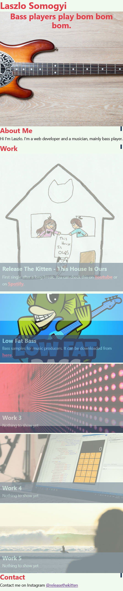

# Bootcamp Module2 Challenge - Portfolio
## Description
This website contains my personal website with portfolio. 
The site has the following functionalities:
* Semantic HTML elements
* Intermediate CSS 
    * Flexbox
    * Grid
    * Responsive design with media queries
* Webpage displays my name, a recent photo, and links to sections about me, my work, and how to contact me
* When one of the links in the navigation is clicked then the UI scrolls to the corresponding section
* When viewing the section about my work then the section contains titled images of your applications
* When presented with my first application then that application's image is larger in size than the others
* When the page is resized or viewed on various screens and devices then the layout is responsive and adapts to the viewport

## Live URL
https://laszlosomogyimusic.github.io/bootcamp-module2-challenge/

## Mock-up
### Wide Screen (laptop or PC)

### Small Screen (smartphone)

